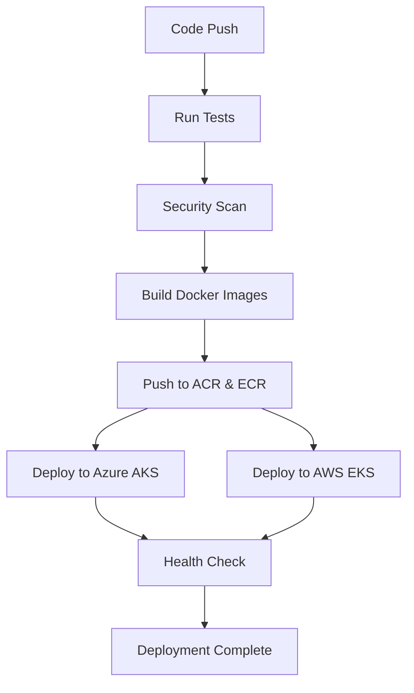

# 🚀 CI/CD Pipeline Summary

## **Pipeline Overview**

### **1. Main CI/CD Pipeline** (`.github/workflows/ci-cd.yml`)
- **Trigger:** Push to `main` branch, PRs to `main`
- **Features:**
  - ✅ Code quality testing
  - ✅ Security scanning
  - ✅ Docker image building
  - ✅ Multi-cloud deployment (Azure + AWS)
  - ✅ Health checks

### **2. Development Pipeline** (`.github/workflows/dev-deploy.yml`)
- **Trigger:** Push to `develop` branch, PRs to `develop`
- **Features:**
  - ✅ Quick testing
  - ✅ Docker image building (no push)
  - ✅ Development validation

### **3. Security Pipeline** (`.github/workflows/security.yml`)
- **Trigger:** Push to any branch, weekly schedule
- **Features:**
  - ✅ NPM security audit
  - ✅ Docker security scanning
  - ✅ Infrastructure security validation

### **4. Rollback Pipeline** (`.github/workflows/rollback.yml`)
- **Trigger:** Manual workflow dispatch
- **Features:**
  - ✅ Emergency rollback
  - ✅ Environment selection (Azure/AWS/Both)
  - ✅ Version selection (Previous/Specific)

## **Deployment Flow**

## **Key Features**

### **🔄 Automated Deployment**
- Push to `main` → Auto-deploy to production
- Push to `develop` → Development testing
- PR → Validation only

### **🐳 Multi-Cloud Support**
- Azure Container Registry (ACR)
- AWS Elastic Container Registry (ECR)
- Both clouds deployed simultaneously

### **🔒 Security First**
- Automated security scanning
- Dependency vulnerability checks
- Container security validation
- Infrastructure security review

### **🔄 Rollback Capability**
- One-click rollback
- Environment selection
- Version selection
- Health verification

## **Benefits for Resume**

### **Technical Skills Demonstrated:**
- ✅ **CI/CD Pipeline Design** - GitHub Actions
- ✅ **Multi-Cloud Deployment** - Azure + AWS
- ✅ **Container Orchestration** - Kubernetes
- ✅ **Infrastructure as Code** - Terraform
- ✅ **Security Automation** - Security scanning
- ✅ **DevOps Best Practices** - Automated testing, deployment, rollback

### **Industry-Standard Tools:**
- ✅ **GitHub Actions** - CI/CD platform
- ✅ **Docker** - Containerization
- ✅ **Kubernetes** - Container orchestration
- ✅ **Terraform** - Infrastructure as Code
- ✅ **Azure/AWS** - Cloud platforms
- ✅ **Security Tools** - Trivy, NPM audit

## **Next Steps**

1. **Add GitHub Secrets** (see `.github/SECRETS_SETUP.md`)
2. **Test Pipeline** - Push to `develop` branch
3. **Deploy to Production** - Push to `main` branch
4. **Monitor Deployments** - Check GitHub Actions tab
5. **Test Rollback** - Use manual rollback workflow

## **Monitoring & Alerts**

- 📊 **GitHub Actions** - Pipeline status
- 🔔 **Email Notifications** - Deployment status
- 📈 **Health Checks** - Service availability
- 🚨 **Rollback Alerts** - Emergency notifications

---

**🎯 This CI/CD pipeline makes your project production-ready and demonstrates advanced DevOps skills!**
